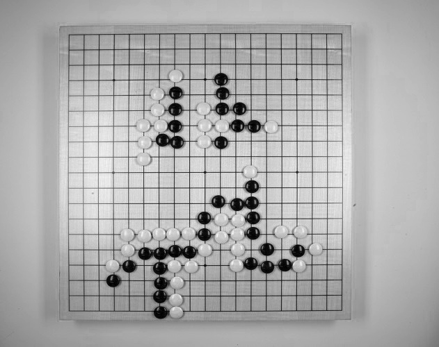
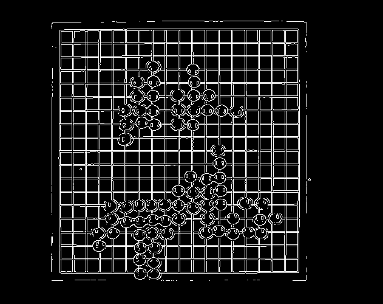
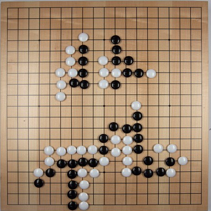

# Go (Weiqi/Baduk) in Racket — with board recognition from photos

A networked implementation of the board game **Go**, written in **Racket** in a
purely functional style. The twist that gave the project its name (*BV* =
*Bildverarbeitung*, German for "image processing"): a game can be started from a
**photograph of a real Go board**. A computer-vision pipeline reads the stone
positions out of the picture, and play then continues over the network.

This was a university project from 2016. The original design and user
documentation (in German) lives under [`doc/`](doc/).

## Features

- Full Go rules implemented functionally: liberties, captures, suicide
  prevention, and territory scoring via flood-fill.
- **Start from a photo**: detect the board, crop it, sample a 19×19 grid, and
  classify each intersection as black / white / empty.
- **Network play** using Racket's `2htdp/universe`: a server holds the game
  state, two clients connect and exchange moves as messages.
- Handicap stones, pass, and end-game scoring (territory + captured stones).
- Mouse + keyboard driven UI rendered with `2htdp/image`.

## How the board recognition works

The pipeline in `src/go_bv.rkt` turns a photo of a real board into a game state,
built by hand on top of [VIGRA](https://ukoethe.github.io/vigra/) primitives:

1. Convert the photo to grayscale and smooth it with a Gaussian filter.
2. Run a **Canny edge detector** and find the board's bounding box from the edges.
3. Crop the image to the board and lay a **19×19 grid** over it.
4. Sample the brightness around each intersection and classify it as
   **black / white / empty**.

| Grayscale input | Canny edges | Cropped board |
|---|---|---|
|  |  |  |

## Project layout

| File                      | Responsibility |
|---------------------------|----------------|
| `src/go_bv.rkt`           | Image-processing pipeline (Canny edges → crop → grid sampling → stone classification) |
| `src/go_logic.rkt`        | Pure game rules: captures, suicide check, scoring |
| `src/go_draw_board.rkt`   | Rendering of the board and all UI screens |
| `src/go_server.rkt`       | Game server / state machine (`universe`) |
| `src/go_client.rkt`       | Player client (`world`) |
| `images/`                 | Sample photos of Go boards used by the recognition step |
| `doc/`                    | Original German design docs and handbooks (PDF + LaTeX) |

### Documentation (German)

| Document | Contents |
|---|---|
| [`doc/Tex/Pflichtenheft/pflichtenheft.pdf`](doc/Tex/Pflichtenheft/pflichtenheft.pdf) | Requirements specification |
| [`doc/Grobentwurf_06_Go.pdf`](doc/Grobentwurf_06_Go.pdf) | High-level design |
| [`doc/Feinentwurf_06_Go.pdf`](doc/Feinentwurf_06_Go.pdf) | Detailed design |
| [`doc/Entwicklerhandbuch_06_Go.pdf`](doc/Entwicklerhandbuch_06_Go.pdf) | Developer handbook |
| [`doc/Spielerhandbuch_06_Go.pdf`](doc/Spielerhandbuch_06_Go.pdf) | Player handbook |

## Requirements

- [Racket](https://racket-lang.org/) (DrRacket recommended)
- The [`vigracket`](https://github.com/BSeppke/vigracket) package — Racket
  bindings to the [VIGRA](https://ukoethe.github.io/vigra/) computer-vision
  library — required only for the photo-recognition feature (`go_bv.rkt`).

  ```sh
  raco pkg install vigracket
  ```

The networking and rendering rely on `2htdp/universe` and `2htdp/image`, which
ship with Racket.

## Running

1. Start the server:

   ```sh
   racket src/go_server.rkt
   ```

2. Start the client. By default `go_client.rkt` opens **two local worlds**
   connected to `localhost`, so you can play both sides on one machine:

   ```sh
   racket src/go_client.rkt
   ```

   For real network play, point the client's `register` at the server's IP
   instead of `LOCALHOST` in `src/go_client.rkt`.

3. To start a game from a photo, set `img-path` near the top of
   `src/go_bv.rkt` to a file in `images/`, then choose "load from image" on the
   start screen.

## Status & known limitations

This is a student project preserved as-is. Worth knowing before you read the code:

- The photo recognition is tuned to specific lighting and to the sample images;
  thresholds in `go_bv.rkt` are hard-coded.
- The **ko rule** is not implemented.
- Scoring is a good approximation but does not handle dead-stone removal or seki;
  players should capture dead groups before passing.
- The image path is fixed at load time rather than chosen at runtime.

## License

No license was attached to the original project. Provided as-is for reference and
educational purposes.
